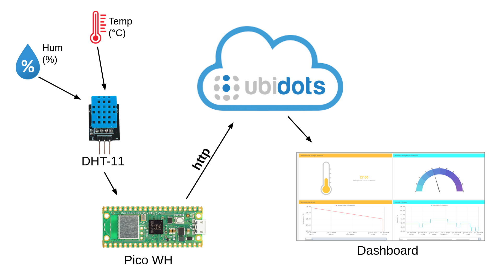
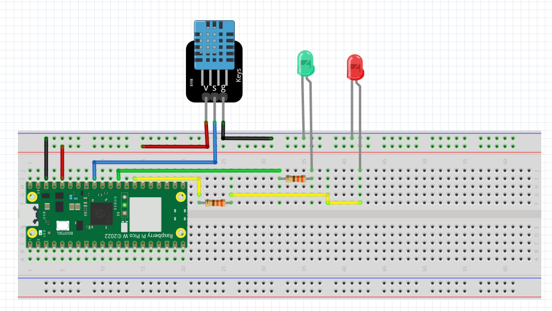
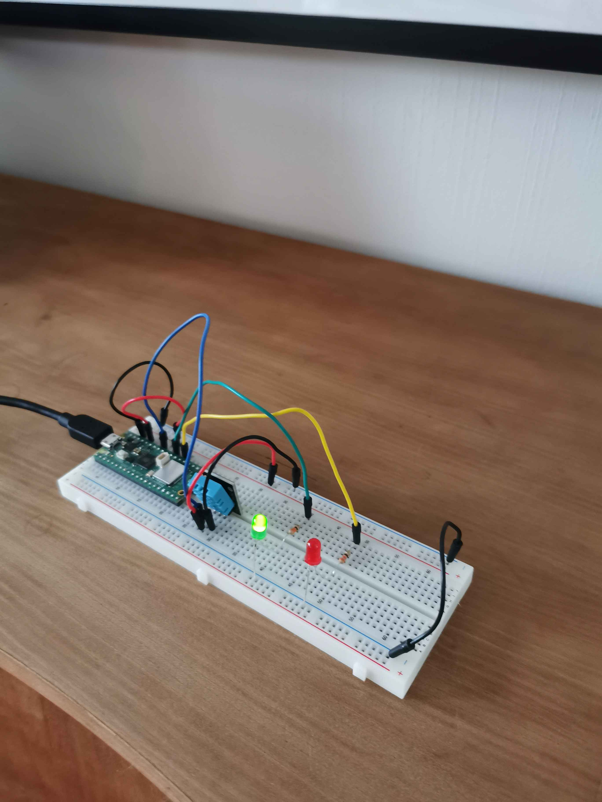
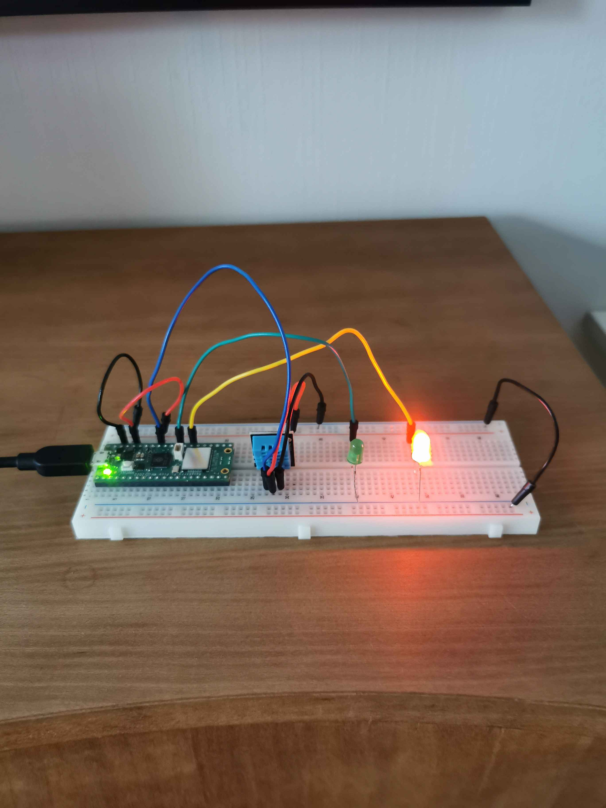

# Temperature &amp; humidity monitor

- **Name:** Viktor Kangasniemi
- **Student Credentials:** vk222pn  

## Project Overview
In this project, a simple temperature and humidity monitoring system is created using the DHT11 sensor and a Raspberry Pi Pico WH microcontroller. With this setup, the system captures temperature and humidity readings, which are then transmitted wirelessly via WiFi to the Ubidots platform for visualization. Two LEDs are included as indicators for the preferred temperature.

**Completion time**: 1-4 hours, depending on previous experience





---

## Objective
I developed this device to address the issue of my home being too cold during the winter. It provides continuous updates on the temperature and humidity of my home, notifying me wherever I am. This ensures I know whether heating of the home is necessary.

The collection of data over time will provide insights into temperature and humidity variations, allowing me to confidently manage the heating of my home.


---

## Material

Detail all the materials needed, including sensors, their specifications, where you bought them, and costs. Include pictures.

| Material               | Description                              | Source      | Cost     |
|------------------------|------------------------------------------|-------------|----------|
| 1x Raspberry Pi Pico WH | Microcontroller                           | Electrokit  | 109 SEK  |
| 1x USB cable            | USB cable A-male - microB-male 1.8m      | Electrokit  | 39 SEK  |
| 1x DHT11 Temperature and Humidity Sensor | Temperature and humidity sensor used in project | Electrokit | 49 SEK   |
| 1x Breadboard           | Standard 830-point breadboard             | Electrokit  | 69 SEK   |
| Jumper Wires            |  Jumper wires 1-pin male-male 150mm 10-pack| Electrokit  | 29 SEK    |
| 2x Resistor             | 330 ohm resistor                         | Electrokit  | 1 SEK    |
| 1x Red LED              | 5mm red diffused LED, 1500 mcd           | Electrokit  | 5 SEK    |
| 1x Green LED            | 5mm green diffused LED, 80 mcd           | Electrokit  | 5 SEK    |


---
## Computer setup
### VS Code with Pymakr Plugin

1. Download Visual Studio Code from [here](https://code.visualstudio.com/download).
2. Follow the instructions [here](https://hackmd.io/@lnu-iot/rkiTJj8O9) to add the Pymakr extension.

### Update Pico Firmware

1. Follow the instructions [here](https://hackmd.io/@lnu-iot/rkFw7gao_).

### Download Code from GitHub

1. Download the code from the "src" folder on [GitHub](https://github.com/myrepo).
2. Upload the code to the Pico.

---

## Putting Everything Together



I used 330-ohm resistors with the LEDs. You can place the LEDs and sensor as you prefer, but make sure the circuit is properly grounded and the appropriate pins on the Pico are selected.

I'm using the following pins:

    GND - Ground
    3v3 - Output voltage
    GP 27 - For the DHT sensor data pin (blue)
    GP 22 - Green LED
    GP 21 - Red LED

---
## Platform


I've chosen [Ubidots](https://ubidots.com/), a cloud-based platform, as the way to recieve and visualize the data. The choice was based on its straightforward setup, configuration, and its ability to present the data in a nice way.

If there would appear scalability needs, consider upgrading from the free tier or exploring alternative platforms like [Adafruit](https://hackmd.io/@lnu-iot/r1yEtcs55?utm_source=preview-mode&utm_medium=rec) or self-hosted solutions such as the [TIG-stack](https://hackmd.io/@lnu-iot/BkwDAimvn).


For creation of account and set up of Ubidots, follow [this](https://hackmd.io/@lnu-iot/r1k63jjwo) tutorial.

---

## The Code

Code structure:
```
src/
├── utils/
│   ├── functions.py
│   ├── ubidots_connection.py
│   ├── wifi_connection.py
│   └── keys.py
├── main.py
├── boot.py
└── pymakr.conf
```

### Keys
Ensure that the keys.py file has all required keys.
```python
#Wifi credentials
WIFI_SSID = 'YOUR_WIFI_SSID'
WIFI_PASS = 'YOUR_WIFI_PASSWORD'

#Ubidots Token
TOKEN = "YOUR_UBIDOTS_API_TOKEN" 
```

### WIFI connection
This code connects the Pico to your WiFi network. Adjust WIFI_SSID and WIFI_PASS to match your network credentials:
```python

import network
from time import sleep
import utils.keys as keys


WIFI_SSID = keys.WIFI_SSID # Assign your the SSID of your network
WIFI_PASS = keys.WIFI_PASS # Assign your the password of your network

#Connect to WIFI
def connect():
    wlan = network.WLAN(network.STA_IF)     # Put modem on Station mode

    if not wlan.isconnected():                  
        print('connecting to network...')
        wlan.active(True)                   # Activate network interface
        wlan.config(pm = 0xa11140)
        wlan.connect(WIFI_SSID, WIFI_PASS)  # Your WiFi Credentials
        print('Waiting for connection...', end='')
        
        # Check if it is connected otherwise wait
        while not wlan.isconnected() and wlan.status() >= 0:
            print('.', end='')
            sleep(1)
    
    # Print the IP
    ip = wlan.ifconfig()[0]
    print('\nConnected on {}'.format(ip))
    return ip
```

### Ubidots connection & functionality
The sendData function sends data to your Ubidots project using the provided API token and label names. The build_json function creates the JSON body that will be sent:
```python
import urequests as requests
import utils.keys as keys

#UBIDOTS 


DEVICE_LABEL = "YOUR_DEVICE_LABEL" # Ubidots device label
TEMPERATURE_VARIABLE_LABEL = "YOUR_TEMP_VARIABLE"  # Ubidots variable label
HUMIDITY_VARIABLE_LABEL = "YOUR_HUM_VARIABLE"  # Ubidots variable label

# Sending data to Ubidots Restful Webserice
def sendData(device, data):
    try:
        url = "https://industrial.api.ubidots.com/"
        url = url + "api/v1.6/devices/" + device
        headers = {"X-Auth-Token": keys.TOKEN, "Content-Type": "application/json"}

        if data is not None:
            print(data)
            req = requests.post(url=url, headers=headers, json=data)
            return req.json()
        else:
            print("No data to send")
            return None
    except Exception as e:
        print("Error sending data: ", e)
        return None


# Builds the json to send the request
def build_json(temp_var, temp_value, hum_var, hum_value):
    try:
        data = {
            temp_var: {"value": temp_value},
            hum_var: {"value": hum_value}
        }        
        return data
    except:
        return None
```

### Main loop
The main loop continuously measures temperature and humidity, sends the data to Ubidots every DELAY seconds, and blinks the onboard LED to show the code is running. Additionally, it checks the is_too_cold function if the temperature drops below the given threshold. If this condition is met, the red LED is activated, otherwise it activates the green LED.

```python
import machine
import dht
from time import sleep
from machine import Pin

import utils.functions as fn
import utils.ubidots_connection as vis
import utils.wifi_connection as wifi


# Set up
sensor = dht.DHT11(machine.Pin(27))  # DHT11 Constructor, Temperature & Humidity Sensor 

on_board_led = Pin("LED", Pin.OUT)

green_led = Pin(22, Pin.OUT)
red_led = Pin(21, Pin.OUT)

# Ubidots labels
DEVICE_LABEL = "YOUR_DEVICE_LABEL" # Ubidots device label
TEMPERATURE_VARIABLE_LABEL = "YOUR_TEMP_VARIABLE"  # Ubidots variable label
HUMIDITY_VARIABLE_LABEL = "YOUR_HUM_VARIABLE"  # Ubidots variable label


DELAY = 5  # Delay in seconds

temp_threshold = 25 # prefered temperature limit, value in celcius

# Connect to the WiFi
wifi.connect()

while True:
    on_board_led.on()

    try:
        sensor.measure()
        temperature = sensor.temperature()
        humidity = sensor.humidity()
        print("Temperature is {} degrees Celsius and Humidity is {}%".format(temperature, humidity))

        temperature_val = temperature
        humidity_val = humidity

        # Build and sent data to Ubidots
        data = vis.build_json(TEMPERATURE_VARIABLE_LABEL, temperature, HUMIDITY_VARIABLE_LABEL, humidity)
        returnVal = vis.sendData(DEVICE_LABEL, data)

        # Updates LEDs depending on the temperature
        if fn.is_too_cold(temperature, temp_threshold):
            green_led.off()
            red_led.on()
        else:
            red_led.off()
            green_led.on()


    except Exception as error:
        print("Exception occurred", error)

    
    on_board_led.off()
    sleep(DELAY)
```

## Transmitting the data

The data is transmitted via Wi-Fi using HTTP. how often the data is sent is determined by the DELAY variable specified in the main.py file. In my setup, data is sent every 5 seconds.

## Presenting the data
For data presentation, I've configured meters for temperature and humidity, accompanied by graphs displaying their respective measurements over time.

Here's how my dashboard looks:


When using the free version of Ubidots, data is stored in the database for up to one month.


## Finalizing the design

Following this tutorial, a very simple humidity and temperature monitor can be created. While there's room for improvement, like better wiring, improved sensor placement, creating a chassi, and potentially soldering the circuit, this project provides a good starting point of the monitoring system.



